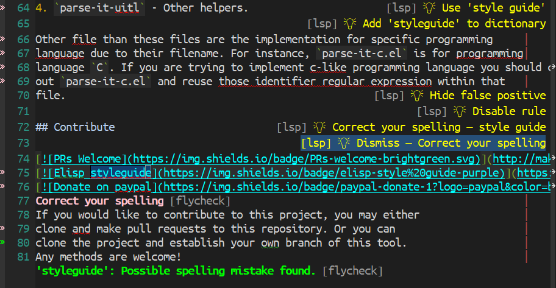
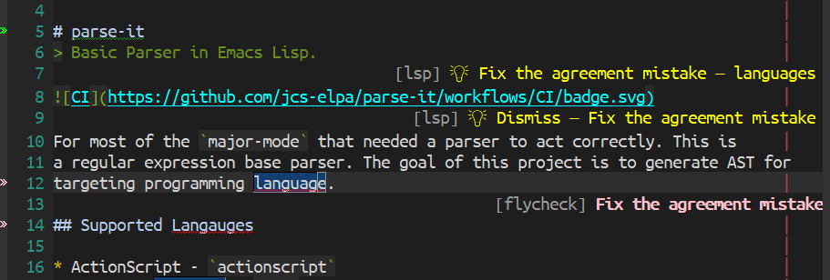

[](https://www.gnu.org/licenses/gpl-3.0)
[](https://jcs-emacs.github.io/jcs-elpa/#/sideline)
[](https://melpa.org/#/sideline)
[](https://stable.melpa.org/#/sideline)

<a href="#"></a>
# sideline
> Show informations on the side

[](https://github.com/emacs-sideline/sideline/actions/workflows/test.yml)

This library provides the frontend UI to display information either on the
left/right side of the buffer window.

*P.S. The implementation is extracted and modified from [lsp-ui-sideline](https://github.com/emacs-lsp/lsp-ui#lsp-ui-sideline)*

<!-- markdown-toc start - Don't edit this section. Run M-x markdown-toc-refresh-toc -->
**Table of Contents**

- [sideline](#sideline)
  - [❓ Why?](#-why)
  - [🔨 Quickstart](#-quickstart)
    - [👥 Configure backends](#-configure-backends)
  - [📌 Define your own backend](#-define-your-own-backend)
  - [❓ FAQ](#-faq)
    - [💫 How to force render the sideline on the next command?](#-how-to-force-render-the-sideline-on-the-next-command)
  - [📂 Example projects](#-example-projects)
  - [🛠️ Contribute](#-contribute)
    - [🔬 Development](#-development)
  - [⚜️ License](#-license)

<!-- markdown-toc end -->

## ❓ Why?

Instead of hard-coded information, we extracted it to multiple different backends.
It allows us to customize the displayed information we want, which is
more flexible and configurable.

## 🔨 Quickstart

```elisp
(use-package sideline
  :init
  (setq sideline-backends-left-skip-current-line t   ; don't display on current line (left)
        sideline-backends-right-skip-current-line t  ; don't display on current line (right)
        sideline-order-left 'down                    ; or 'up
        sideline-order-right 'up                     ; or 'down
        sideline-format-left "%s   "                 ; format for left aligment
        sideline-format-right "   %s"                ; format for right aligment
        sideline-priority 100                        ; overlays' priority
        sideline-display-backend-name t))            ; display the backend name
```

Then you enable `sideline-mode` depends on the backend you use. For example:

```elisp
(use-package sideline
  :hook ((flycheck-mode . sideline-mode)   ; for `sideline-flycheck`
         (flymake-mode  . sideline-mode))  ; for `sideline-flymake`
  ...
```

Some backends require extra setup. `sideline-flycheck` is one of that backends:

```elisp
(use-package sideline-flycheck
  :hook (flycheck-mode . sideline-flycheck-setup))
```

Or simply `M-x sideline-mode`!

### 👥 Configure backends

The most basic way to set up the backends for sideline.

```elisp
(use-package sideline
  :init
  (setq sideline-backends-left '(sideline-flycheck)
        sideline-backends-right '(sideline-lsp)))
```

<p align="center">

</p>

Alternatively, you could set it to cons cell with the search order.

```elisp
(use-package sideline
  :init
  (setq sideline-backends-right '((sideline-lsp      . up)
                                  (sideline-flycheck . down))))
```

<p align="center">

</p>

## 📌 Define your own backend

Following is an example code to define your own sideline backend:

```elisp
(defun my-backend (command)
  "Example backend."
  (cl-case command
    (`candidates '("info 1" "info 2" "info 3"))  ; required
    (`action (lambda (candidate &rest _)   ; optional
               (message "Execute command for `%s`!" candidate)))))
```

or define it asynchronously:

```elisp
(defun my-backend-async (command)
  "Example async backend."
  (cl-case command
    (`candidates (cons :async (lambda (callback &rest _)
                                (funcall callback '("info 1" "info 2" "info 3")))))
    (`action ...)))
```

then you can tell your user to...

```elisp
(setq sideline-backends-left '(my-backend))  ; use `sideline-backends-right' for right alignment
```

Here is a list of supported commands:

- `candidates` - list of strings to display; accept async function
- `action` - (optional) callback function after the mouse click
- `face` - (optional) face overrides the default sideline face
- `name` - (optional) backend name to display

## ❓ FAQ

### 💫 Why is sideline not being render?

`sideline` omit the information by default when the message is too long to
display on the screen. You can force display these long messages by doing:

```elisp
(setq sideline-force-display-if-exceeds t)  ; display it regardless the message length
```

or

```elisp
(setq sideline-truncate t)  ; force display but truncate it when too long
```

*📝 P.S. `sideline-truncate` is enabled by default after version `0.3.0`!*

### 💫 How to force render the sideline on the next command?

You can force update sideline by adding a hook or advice with the function
`sideline-render-this`.

```elisp
(add-hook 'ts-fold-on-fold-hook #'sideline-render-this)
```

## 📂 Example projects

- [sideline-blame](https://github.com/emacs-sideline/sideline-blame)
- [sideline-flycheck](https://github.com/jcs-elpa/sideline-flycheck)
- [sideline-flymake](https://github.com/emacs-sideline/sideline-flymake)
- [sideline-lsp](https://github.com/jcs-elpa/sideline-lsp)
- [sideline-eldoc](https://github.com/ginqi7/sideline-eldoc)
- [sideline-color](https://github.com/emacs-sideline/sideline-color)
- [sideline-load-cost](https://github.com/emacs-sideline/sideline-load-cost)

## 🛠️ Contribute

[](http://makeapullrequest.com)
[](https://github.com/bbatsov/emacs-lisp-style-guide)
[](https://www.paypal.me/jcs090218)
[](https://www.patreon.com/jcs090218)

If you would like to contribute to this project, you may either
clone and make pull requests to this repository. Or you can
clone the project and establish your own branch of this tool.
Any methods are welcome!

### 🔬 Development

To run the test locally, you will need the following tools:

- [Eask](https://emacs-eask.github.io/)
- [Make](https://www.gnu.org/software/make/) (optional)

Install all dependencies and development dependencies:

```sh
$ eask install-deps --dev
```

To test the package's installation:

```sh
$ eask package
$ eask install
```

To test compilation:

```sh
$ eask compile
```

**🪧 The following steps are optional, but we recommend you follow these lint results!**

The built-in `checkdoc` linter:

```sh
$ eask lint checkdoc
```

The standard `package` linter:

```sh
$ eask lint package
```

*📝 P.S. For more information, find the Eask manual at https://emacs-eask.github.io/.*

## ⚜️ License

This program is free software; you can redistribute it and/or modify
it under the terms of the GNU General Public License as published by
the Free Software Foundation, either version 3 of the License, or
(at your option) any later version.

This program is distributed in the hope that it will be useful,
but WITHOUT ANY WARRANTY; without even the implied warranty of
MERCHANTABILITY or FITNESS FOR A PARTICULAR PURPOSE.  See the
GNU General Public License for more details.

You should have received a copy of the GNU General Public License
along with this program.  If not, see <https://www.gnu.org/licenses/>.

See [`LICENSE`](./LICENSE) for details.
